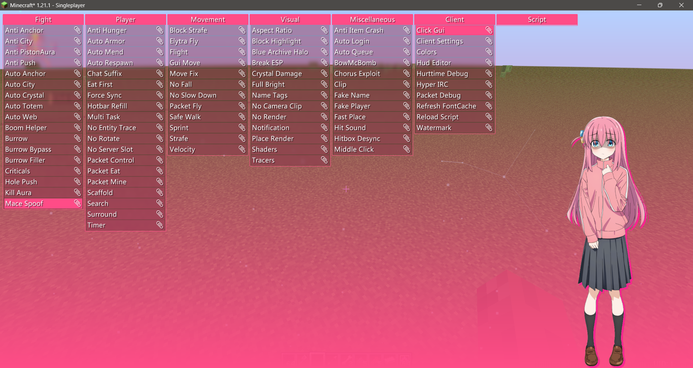

# NullHack-nextgen

A utility mod migrated to the newest Minecraft versions via Fabric, Neoforge & Mixin.

Support for 1.21.5 and newer mc versions will be released with both OpenGL & Vulkan support after mc's Vulkan backend is implemented.
Before that I will continue the development of NullHack privately. You can keep contact with me by opening an issue in this repo.

## Disclaimer

**This project is for educational purposes only. I shall not be held responsible for any personal losses or legal liabilities arising from the use of this project.**

## Requirements

- OS: Windows. Linux will be supported in the future(native dependencies' matter).
- CPU: 6th Gen Intel Core i3 or AMD equivalent.
- Ram: At least 6GB for Minecraft.
- Graphics: OpenGL 4.5 or Vulkan 1.3 (See [Additional requirements](#additional-requirements-from-features)). 
You may check the capabilities of your graphics card via GPU-Z.

### Additional requirements from features
- `GL_ARB_sparse_texture`, required by ArrayedUnicodeFontRenderer
- `GL_ARB_debug_output`, required if the graphics device doesn't support GL43
- `GL_ARB_direct_state_access`, required if the graphics device doesn't support GL45
- `GL_ARB_gl_spirv`, reversed for future use if the graphics device doesn't support GL46
- `GL_MAX_ARRAY_TEXTURE_LAYERS >= 512`, required by ArrayedUnicodeFontRenderer if the device doesn't support GL45
- ArrayedUnicodeFontRenderer is not expected to work on Intel graphics cards.
The feature should be disabled when such a device is used to run Minecraft.

## Screenshots

Click Gui

## Quick Start

1. Clone this repository.
2. Import the project in Intellij IDEA. Then run `build` task to obtain a jar or run the project in IDE
via `Neoforge Client` or `Fabric Client` configuration, which should be generated by the build script automatically.

## Usage

To open the configuration menu you need to press `I`. Then the `Click Gui` module will be 
enabled and you'll see the configuration screen.

## License

This repository is licensed under the GNU General Public License v3. 
You may use code published here in your own projects (if open-source) under the same license.
You may use the code from this repository if and only if your project is open-source, and your distributions must be under the same license.

## Feedback

If you encounter bugs or conflicts with other mods, please open an issue in this repository.
Conflicts with Sodium or Iris are prioritized.

## Credits

- [TrollHack](https://github.com/Luna5ama/TrollHack), [Kmogus](https://github.com/Luna5ama/Kmogus) by [Luna5ama](https://github.com/Luna5ama)
- [Boar/AimTrainer](https://github.com/SpartanB312/AimTrainer) by [SpartanB312](https://github.com/SpartanB312)

## Friendship Links
[Sakura](https://github.com/ExceptionTeam6969/Sakura)